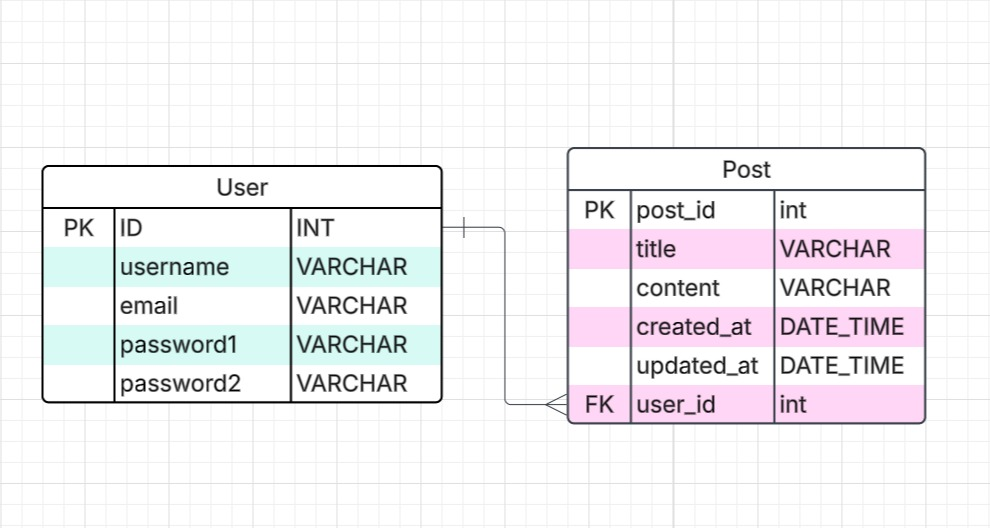

# Social Media App
--Author
This project is developed and maintained by **S.U Ishmam**. 
You can reach me at [email@example.com](mailto:sahiluddinishmam@gmail.com) or find me on [LinkedIn](https://www.linkedin.com/in/sahil-uddin-ishmam-8707301a3/).


This is a Django-based web application that provides a full-featured platform for users to perform CRUD (Create, Read, Update, Delete) operations. The application allows users to interact with data in an intuitive and secure way, with built-in user authentication and authorization features. Users can register, log in, and manage their accounts with ease.

## Prerequisites

Before you begin, ensure you have the following installed:

- Python (version 3.8 or higher)
- pip (Python package manager)
- Git
- Pipenv for managing dependencies.

## Features

- Post Creation
- Post Update
- Post Deletion
- Post Edit/Update
- Post Viewing
- User Authentication
- User Login
- User Logout
- User Sign-Up
- View All Posts
- User Profile View
- Post Management
- Admin Controls


## Tech

Social Media App uses a number tools and technology to create it :

- [Python] - As a main language(backend)
- [Django] - Backend (Model,View,Template)
- [HTML] - Markup Langauage
- [Crispy] - For form Style
- [Bootstrap] - great UI boilerplate for modern web apps
- [SQLite] - A lightweight Database
- [Pipenv] - A Great Virtual Environment 
- [Git and Github] - For Version Control

## ERD for the Project


## Installation

Social Media App requires [Django] to run.

Install the dependencies and development Dependencies.
## Install Depencency 

```sh
- TO Install Python > [ pip install python ]
- To install pipenv > [ pip install pipenv ]
- To Install Django > [ pipenv install django ]
- To Install Cripsy > [ pip install crispy-forms ]
```

## Intial Setup
```
- Clone the repo > git clone https://github.com/Sahil-Ishmam/Social_Media_App.git
- cd your-repository
- Set Up the Database > python manage.py migrate
If you want to create a superuser for accessing the Django admin panel
-  To createSuperuser : python manage.py createsuperuser
```

I have created 2 superuser already
1. name: ishmam  
Password: ishmam
2. name : admin
passowrd: admin

# Run the Development Server
Once everything is set up, you can run the development server:
```sh
python manage.py runserver
```
Visit http://127.0.0.1:8000/ in your browser to view the project.


```sh
127.0.0.1:8000
```
## Additional Notes

- This project is in its early stages, so feel free to contribute by submitting pull requests.
- If you encounter any issues or bugs, please report them on the [issues page](https://github.com/Sahil-Ishmam/Social_Media_App//issues).
- Make sure to keep your dependencies up to date using `pipenv update`.

## License

MIT

**Free Software, Hell Yeah!**
